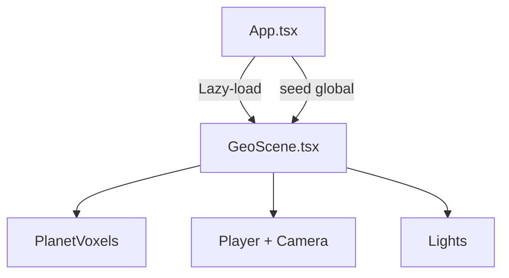
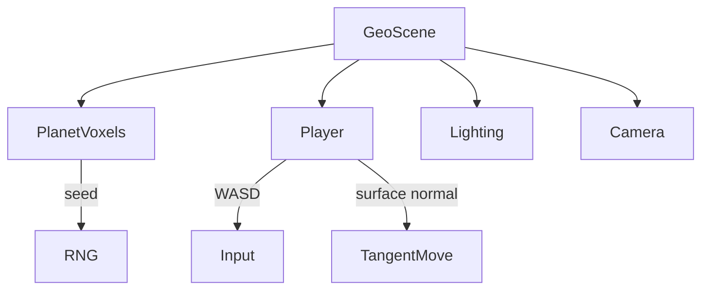
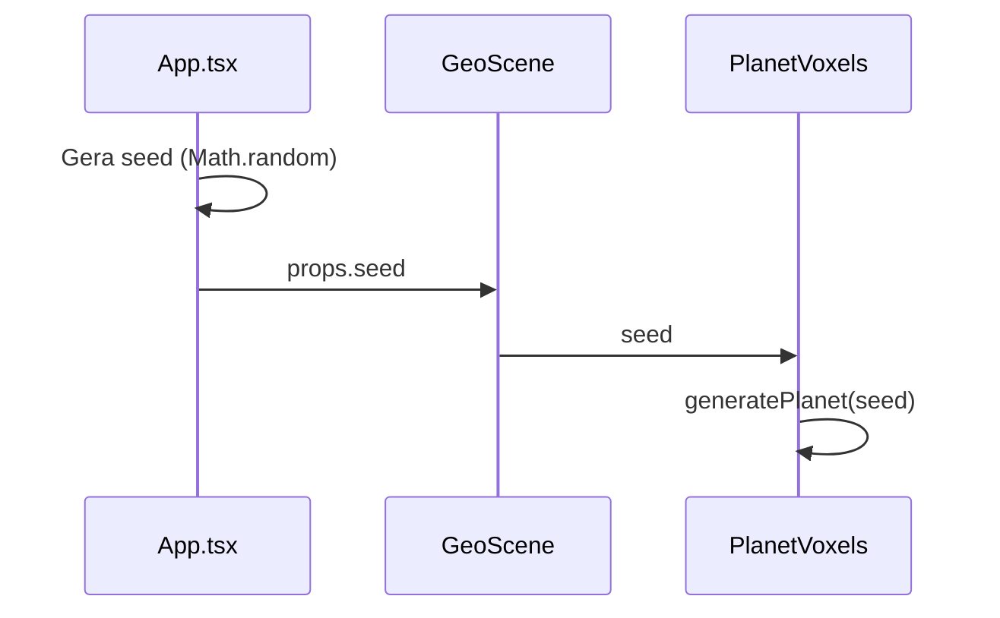
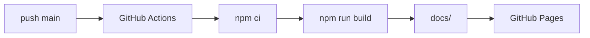

# Technical Guide (humans + machines)

Este documento descreve a arquitetura, fluxo de dados e módulos do simulador, com diagramas para rápida compreensão e evolução.

## Visão geral

- Frontend: React + Vite + TypeScript.
- Renderização 3D: Three.js via React Three Fiber (R3F) e Drei.
- Build/Deploy: GitHub Actions gera `docs/` (GitHub Pages).

## Fluxo de alto nível (UI → Cena)

## Arquitetura de cena

## Fluxo de dados do `seed`

## Regras técnicas essenciais

1) **Seed único e determinístico**
- Todas as features devem aceitar `seed` como entrada.

2) **Escala global**
- `PLANET_RADIUS` e `VOXEL_SIZE` são fonte única de verdade.

3) **Performance**
- Preferir instancing para voxels.
- Não alocar objetos dentro de `useFrame`.

4) **Câmera em 1ª pessoa**
- Câmera segue personagem e olha na direção do movimento.

## Módulos e responsabilidades

| Módulo | Responsabilidade |
|---|---|
| `src/App.tsx` | UI, lazy-load, seed global |
| `src/scene/GeoScene.tsx` | Cena principal, iluminação, player |
| `src/scene/` | Componentes 3D e sistemas |

## Padrões de extensão (para IA e humanos)

- Novo sistema → `src/scene/systems/`
- Novo material/shader → `src/scene/materials/`
- Utilitários → `src/scene/utils/`

## Diagrama de build/deploy

## Check de consistência

- [ ] Usa `seed` global
- [ ] Respeita escala
- [ ] Mantém lazy-load
- [ ] Mantém 1ª pessoa
- [ ] Não cria objetos em `useFrame`
